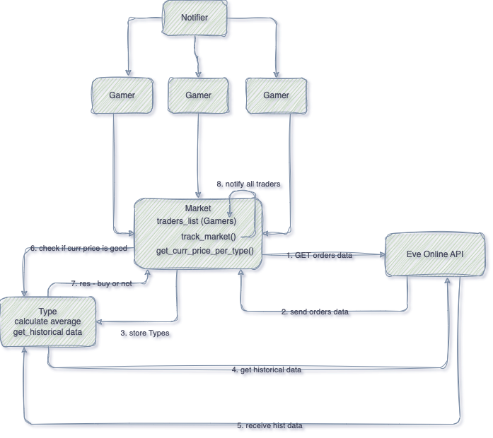
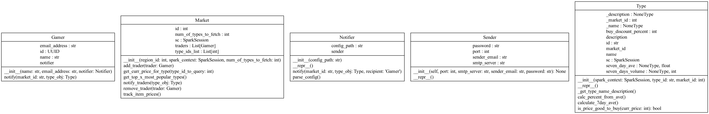

# EVE Online Market Price Analyzer

[](https://github.com/pylint-dev/pylint)

This app creates a Market which will keep track of the current prices for top x (configurable) types that are traded in this market. If the price is lower than a certain configurable percentage, it will send an email to all the traders/gamers subscribed to it. 
It simulates livestream but actually fetches every few seconds. It calculates the average price from the last 7 days for the given type and calculates the discount price from that and compares the discount price to the latest price. The latest price is the price of SELL orders for that given type on that given market where the price is lowest for the last day and there are volumes left (stock basically left to buy). More info on Even online in the links below.

- [Error handling](https://developers.eveonline.com/blog/error-rate-limiting-imminent)
- [Applications EVE Online](https://developers.eveonline.com/applications)
- [API UI](https://esi.evetech.net/ui/) 
- [Swagger hub](https://apidog.com/apidoc/project-346592/api-3531125) 

## Diagrams

### High-level diagram



### Class diagram



---

## How to run

### Locally

- Make sure you have Java 17 or less installed (for spark)
- Add config for the SMTP service with your email address and password, not a great practice, but this config file is not tracked so will be stored on your machine only. 
`src/vault/config.yaml`
 with the following syntax

```yaml
password: "llamapassword"   # if using gmail you need to generate an App password first and use that for which you need to enable 2FA. 
port: '465'   # smtp secure port
sender_email: llama@gmail.com
smtp_server: smtp.gmail.com
```

- Check out the variables inside `settings/common.py` to see if there's anything you'd like to update. 
- inside `docker-compose.yaml` you can change the number of replicas to run

And then run.. 

```bash
make install
make run
```

### With docker

- Add config for the SMTP service with your email address and password, not a great practice, but this config file is not tracked so will be stored on your machine only. 
`src/vault/config.yaml`
 with the following syntax

```yaml
password: "llamapassword"   # if using gmail you need to generate an App password first and use that for which you need to enable 2FA. 
port: '465'
sender_email: llama@gmail.com
smtp_server: smtp.gmail.com
```

- Check out the variables inside `settings/common.py` to see if there's anything you'd like to update. 
- inside `docker-compose.yaml` you can change the number of replicas to run

And then run.. 

```bash
make build
make run_with_docker
```

---

## TODO:
- [x] `Notifier` class ready
  - [x] config parser for credentials
  - [x] `notify()`
- [ ] `Gamer` class ready
  - [x] `notify()` works 
- [ ] `Market` class ready     (CORE class)
  - [x] `type_ids_list` is generated via `get_top_x_types()` [API calls]  
  - [ ] `track_types()` works   (CORE method) [API calls] 
  - [x] `add_trader()` works 
  - [x] `remove_trader()` works 
- [x] `Type` class ready
  - [x] `calculate_7day_average()` works
  - [x] `is_price_good_to_buy()` works
- [x] Initial data fetching is ready
- [x] error limit for API calls is accounted for and handled
- [x] Simulate live data stream
  - [x] with sleeping
  - [ ] with asyncio OR
  - [ ] queue OR
  - [ ] real rabbitMQ instance
- [ ] Unit tests
- [x] Enable configurable options for:
  - [x] percentage discount on price
  - [ ] region_id (market) - added to config but unused yet
- [x] Deploy to Docker with k8s
  - [x] enable scaling via changing replica number
- [ ] Docstrings everywhere OR
  - [x] Extensive and descriptive logging OR 
  - [ ] preferably both
- [ ] Documentation
  - [x] Class diagrams (cheated - generated with `pyreverse`)
  - [ ] Extensive Readme file, not this one.. 
- [x] Demo video

### Notes:
- Focused on `avoiding redundant` API calls as much as possible
- Focused on `removing code duplication` as much as possible, e.g. the bug logger message inside `type.is_price_good_to_buy()` as well as not to call the calculations twice
- organizing the imports according to standards
- focused on writing `many logs` and as descriptive as possible
- goal is `the main app to be as simple as possible` with as little instances as possible `app.py`
- focused on `composition` instead of `inheritance`, which enables for easier extension (Open-closed principle), and for keeping the focus of classes on their own thing (Single resp principle) and for decoupling reasons 


## Flaws
- Sometimes it cannot determine the current price, i think it may be because i fetch only the last 2 days and maybe there are no orders, if i have time i will check. I do save the data for debugging when that happens, name starts with `DEBUG_`
- 30% below average never triggers any warnings, so either I have made a mistake with fetching the wrong data or it needs more time tracking or i don't know. So I have added an option to configure the percentage for discount and it's currently set at 3%
